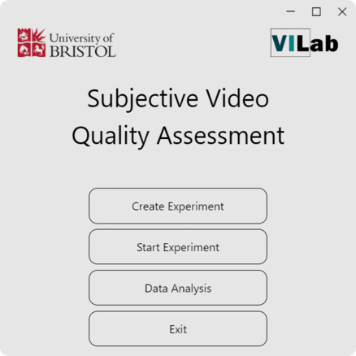

# SVQA

SVQA is a software that allows people to subjectively assess video quality. SVQA is developed at the University of Bristol as part of a final year project.

# Requirements

* Operating system: Windows, Linux or macOS
* Python 3.5
    - Windows: you can download the Python 3.5 distribution from https://www.python.org/downloads/release/python-354rc1/
    - Linux: `sudo add-apt-repository ppa:deadsnakes/ppa` `sudo apt-get update` `sudo apt-get install python3.5`
    - macOS: `https://www.python.org/downloads/mac-osx/
    - Run the following command from the folder where requirements.txt is located to install the necessary python libraries - `pip install -r requirements.txt`
* NodeJS
    - It can be downloaded and installed from `https://nodejs.org/en/` for all platforms
* ElectronJS
    - Run the following command to install electron globally - `npm install -g electron`
* FFMPEG
    - Windows: provided with the application repository and no extra steps are required.
    - Linux: you can install it using the following three commands:
       - sudo add-apt-repository universe
       - sudo apt update
       - sudo apt install ffmpeg
    - macOS: The simplest way to install ffmpeg on Mac OS X is with [Homebrew](http://mxcl.github.com/homebrew/). Once you have Homebrew                installed install ffmpeg from the Terminal with the following: `brew install ffmpeg`.
 * MPV player
    - Windows: provided with the application repository and no extra steps are required.
    - Linux: install it via `sudo apt-get install mpv`
    - macOS: install it by using [Homebrew]: `brew install mpv`
 * VMAF
    - Windows: provided with the application repository and no extra steps are required.
    - Linux: NOT YET AVAILABLE!
    - macOS: NOT YET AVAILABLE!
    
# Steps to start the software

1. Install all requirements
2. Clone the repository
3. Open the repository folder
4. Run `npm install` from a command line in that folder
5. Start the software by opening any of the two files named `start`.

# Tutorials (available in tutorials folder)
  * Creating an Experiment
  * Starting an Experiment
